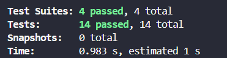
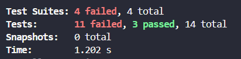

# Consultor de CEP 🏠

Um projeto Node.js simples  para consultar informações de CEPs brasileiros.

## 📋 Funcionalidades

- Consulta de CEPs brasileiros via API ViaCEP
- Interface interativa via linha de comando
- Validação de entrada de dados
- Exibição formatada das informações do endereço

## 🚀 Tecnologias Utilizadas

- **Node.js** - Runtime JavaScript
- **Axios** - Cliente HTTP para fazer requisições à API
- **Readline-sync** - Biblioteca para entrada de dados via terminal
- **ViaCEP API** - API gratuita para consulta de CEPs

## 📦 Dependências

- `axios`: ^1.6.0 - Para fazer requisições HTTP
- `readline-sync`: ^1.4.10 - Para capturar entrada do usuário

## 🛠️ Como executar

1. **Instalar as dependências:**
   ```bash
   npm install
   ```

2. **Executar o projeto:**
   ```bash
   npm start
   ```
   ou
   ```bash
   npm run dev
   ```

## 💡 Como usar

1. Execute o projeto
2. Digite um CEP no formato `12345-678` ou `12345678`
3. Visualize as informações retornadas
4. Escolha se deseja consultar outro CEP ou sair

## 📝 Exemplo de uso

```
🏠 Bem-vindo ao Consultor de CEP!
Digite "sair" para encerrar o programa

Digite o CEP (formato: 12345-678 ou 12345678): 01310-100

🔍 Buscando informações do CEP: 01310100...

📍 Informações do CEP:
========================
CEP: 01310-100
Logradouro: Avenida Paulista
Bairro: Bela Vista
Cidade: São Paulo
Estado: SP
DDD: 11
IBGE: 3550308
========================

Deseja consultar outro CEP? (s/n): n
👋 Obrigado por usar o Consultor de CEP!
```

## 🔧 Estrutura do projeto

```
ProjetoC14-RELA/
├── package.json      # Configurações e dependências do projeto
├── index.js          # Arquivo principal da aplicação
├── README.md         # Documentação do projeto
└── node_modules/     # Dependências instaladas
```


- **ViaCEP**: [https://viacep.com.br/](https://viacep.com.br/)
  - API gratuita e sem necessidade de chave
  - Retorna informações completas de endereços brasileiros

## ⚠️ Tratamento de Erros
- Formato incorreto de CEP
- Erros de requisição HTTP

## 🛠️ Resolução de Conflitos
Ocorreu um conflito de merge devido à alteração dos nomes das variáveis `axios` e `readlineSync` pelo colega Matheus em sua branch. Ao tentar realizar o merge, o Git identificou diferenças nessas linhas, impedindo a fusão automática.
- Na tela de resolução de conflitos, optei por manter os nomes das variáveis conforme estavam na branch base (`axios` e `readlineSync`), garantindo a padronização do código.
- Após salvar a resolução, finalizei o merge pela interface do GitHub.
- O histórico do repositório registra a resolução do conflito e a decisão tomada.
- O projeto segue padronizado e funcional para todos os colaboradores.

## 🧪 Testes Unitários
O projeto possui testes automatizados usando Jest, cobrindo casos positivos e negativos para garantir robustez e qualidade do sistema.

### Casos de testes implementados
- Validação de CEPs válidos e inválidos
- Formatação de CEP
- Exibição de dados com todos os campos nulos
- Exibição de data/hora atual

### Como executar os testes

```bash
npm test
```

### ✅ Print dos testes antes do PR



### ❌ Print dos testes após o PR do Matheus

O Matheus alterou uma linha do código na branch dele. Após essa modificação, ao rodar os testes, 11 dos 14 testes que anteriormente passavam começaram a falhar.

Veja o print dos testes após o PR dele:



#### Detalhes dos erros encontrados

Após o PR do Matheus, diversos testes começaram a falhar pois ele apagou a funcionalidade original dos métodos afetados, removendo o comportamento esperado das funções. Isso contribuiu para a falha dos testes, pois os métodos deixaram de executar suas operações corretas.
- Testes que falharam: 11
- Testes que passaram: 3


